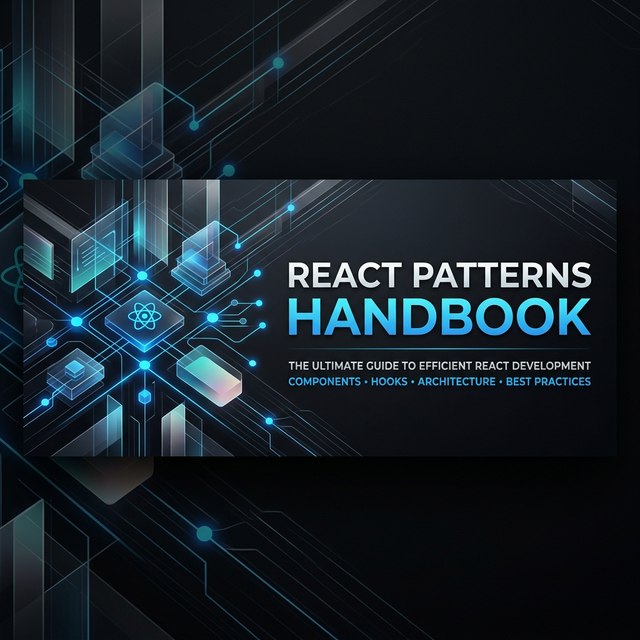

<div align="center">
  

  # 🧠 React Patterns Handbook (2026 Edition)
  ### Architecture • Performance • Scalable Systems

  [](https://opensource.org/licenses/MIT)
  [](https://reactjs.org/)
  [](https://www.typescriptlang.org/)
  [](https://github.com/Shaswatchoudhary)

  <p align="center">
    <strong>A structured React engineering reference that consolidates core and advanced architectural patterns into a practical, implementation-focused handbook. Focused on state architecture, async systems, performance optimization, and scalable UI design.</strong>
  </p>
</div>

---

## � Introduction

Frontend development is no longer just about building UI. It is about architectural decisions, async coordination, performance trade-offs, and scalable system design. This handbook serves as a:

- **Structured React architecture reference** for building resilient applications.
- **Performance engineering checklist** to optimize for speed and memory.
- **Frontend interview deep-dive resource** for mastering core concepts.
- **Foundation for scalable UI systems** using industry-standard patterns.

---

## 📑 Table of Contents

- [Core State Architecture](#-core-state-architecture)
- [Component Design Patterns](#-component-design-patterns)
- [Async & Data Patterns](#-async--data-patterns)
- [Performance Optimization Patterns](#-performance-optimization-patterns)
- [Modern React Architecture (2026)](#-modern-react-architecture-2026)
- [Project Structure](#-project-structure)
- [Installation](#-installation)
- [Usage](#-usage)
- [Roadmap](#-roadmap)
- [Contributing](#-contributing)
- [License](#-license)

---

## 🏛 Core State Architecture

### 1. Local vs Global State
- **When to use local state:** Start with `useState`. If the data only affects one component and its children, keep it local.
- **When global state is required:** Use Context or state management libraries (Zustand, Redux) when data is needed by many components across different branches of the tree (e.g., Theme, Auth).
- **Trade-offs:** Global state increases complexity and potential for unnecessary re-renders.
- **Anti-patterns:** Putting every piece of state into a global store (Store Bloat).

### 2. Server State vs UI State
- **Data synchronization:** Separate data fetched from APIs (Server State) from transient data like form inputs or modal toggles (UI State).
- **Caching strategies:** Use tools like React Query or SWR for automatic caching and revalidation.
- **Invalidation logic:** Define clear rules for when server data should be refreshed.

### 3. Context API + useReducer
Combining Context with `useReducer` creates a robust, Redux-like pattern without external dependencies. Perfect for complex local state or "scoped" global state.

```jsx
const StateContext = React.createContext();

function Provider({ children }) {
  const [state, dispatch] = useReducer(reducer, initialState);
  return <StateContext.Provider value={{ state, dispatch }}>{children}</StateContext.Provider>;
}
```

### 4. State Reducer Pattern
Allows consumers to override internal state transitions by passing a custom reducer.

> [!TIP]
> This pattern is highly extensible for building building complex UI components like Toggles or Carousels where the user might want a slightly different behavior.

### 5. State Co-location
Keep state as close as possible to the component that uses it. This minimizes the scope of re-renders and makes the code easier to reason about.

---

## 🧩 Component Design Patterns

### Higher-Order Components (HOC)
A function that takes a component and returns an enhanced component.
*Note: Mostly replaced by Hooks, but still useful in some architectural contexts.*

### Render Props
A pattern where a component's content is defined by a function passed as a prop.
```jsx
<DataProvider render={(data) => <Display data={data} />} />
```

### Container / Presentational Pattern
Separating "how things work" (logic) from "how things look" (UI).

### Custom Hooks
The modern standard for logic reuse. Extracting logic into `useSomething` functions.

### Compound Components
Components that work together to maintain shared implicit state (e.g., `<Select>` and `<Option>`).

### Controlled vs Uncontrolled Components
- **Controlled:** React state drives the input value (High predictability).
- **Uncontrolled:** The DOM maintains the value, accessed via `ref` (Simpler for simple forms).

---

## � Async & Data Patterns

- **Debounce vs Throttle:** 
  - *Debounce:* Wait for a pause in events before triggering (Search inputs).
  - *Throttle:* Trigger at most once per time interval (Scroll events).
- **Cancel Previous Requests:** Using `AbortController` to prevent race conditions from stale responses.
- **Race Condition Handling:** Ensuring that only the latest request's data is applied to the state.
- **In-memory Caching:** Storing API results to prevent redundant network requests.
- **Suspense & React.lazy:** Declarative loading states and code-splitting for better initial load performance.

---

## ⚡ Performance Optimization Patterns

- **React.memo:** Prevents re-renders of a component if its props haven't changed.
- **useMemo:** Memoizes expensive calculations.
- **useCallback:** Stabilizes function references between renders.
- **Large List Optimization:** Using **Virtualization** (e.g., `react-window`) to only render items currently in the viewport.
- **Profiling:** *Always* profile your application using the React DevTools Profiler before applying optimizations.

> [!WARNING]
> Don't over-optimize. `useMemo` and `useCallback` have their own memory overhead. Use them when you identify a performance bottleneck.

---

## � Design & Aesthetics (2026 Edition)

In 2026, React engineering is as much about **UI/UX excellence** as it is about clean code. This project follows these core design pillars:

- **Glassmorphism & Depth:** Using backdrop blurs and subtle borders for modern depth.
- **Dynamic Micro-animations:** Smooth transitions and hover effects to make the UI feel "alive".
- **Semantic Color Systems:** Using HSL/OKLCH for consistent, accessible color palettes.
- **Dark Mode First:** Prioritizing high-contrast, easy-on-the-eyes dark themes with vibrant accents.

> [!IMPORTANT]
> To run these examples with full styling, ensure **Tailwind CSS** or the project-specific CSS is correctly installed.

---

## �🏗 Modern React Architecture (2026)

1. **Local state first** — Do not lift state until absolutely necessary.
2. **Extract reusable logic into custom hooks** — Hooks are the primary unit of reuse.
3. **Context for shared state** — Use it for cross-cutting concerns, not for everything.
4. **Reducers for complex transitions** — Use `useReducer` for state that has complex logic or transitions.
5. **Controlled forms for predictability** — Standardize form handling for easier validation.
6. **Memoization by Profile** — Only memoize when profiling justifies the complexity.
7. **Virtualization for large datasets** — Critical for high-performance dashboards and lists.
8. **Async boundaries with Suspense** — Leverage modern concurrent features for better UX.

---

## 📂 Project Structure

```text
react-design-patterns/
├── README.md                          # Project documentation
├── assets/                            # Brand assets and images
├── State Reducer Pattern/             # Advanced state control logic
├── controlleduncontrolled/            # Form handling strategies
├── renderprops/                       # Logic sharing via props
├── props/                             # Prop drilling & management
├── useeffect/                         # Side effect handling patterns
├── reactlazy&suspense/                # Code splitting & async boundaries
├── Debouncing & Search Optimization/ # Performance & Async patterns
├── learning/                          # Core React fundamentals
└── adonisframework/                   # Full-stack integration patterns
```

---

## ⚙️ Installation

### Prerequisites
- **Node.js 18+**
- **React 18+**
- **npm** or **yarn**

### Steps
1. **Clone the repository:**
   ```bash
   git clone https://github.com/Shaswatchoudhary/React_Pattern.git
   ```
2. **Navigate to the directory:**
   ```bash
   cd React_Pattern
   ```
3. **Explore a pattern:**
   ```bash
   cd "State Reducer Pattern/State Reducer Pattern(advance)"
   npm install
   npm start
   ```

---

## 🚀 Usage

Each folder contains an isolated example of a specific React pattern. Navigate to a pattern directory and run it independently to see the implementation in action.

```bash
# Example for Render Props
cd renderprops/renderprops
npm install
npm start
```

---

## 🗺 Roadmap

- [ ] **Advanced Frontend & Backend Architecture** — System design for full-stack apps.
- [ ] **Async Data Architecture patterns** — Deep dive into state synchronization.
- [ ] **System Design Fundamentals** — Load balancing, scaling, and distribution.
- [ ] **Backend Fundamentals** — API design & Node.js best practices.
- [ ] **Docker & Deployment workflows** — Containerization for React apps.
- [ ] **Full-stack performance considerations** — E2E optimization.

---

## 🤝 Contributing

Contributions are what make the open-source community such an amazing place to learn, inspire, and create. Any contributions you make are **greatly appreciated**.

1. Fork the Project
2. Create your Feature Branch (`git checkout -b feature/AmazingFeature`)
3. Commit your Changes (`git commit -m 'Add some AmazingFeature'`)
4. Push to the Branch (`git push origin feature/AmazingFeature`)
5. Open a Pull Request

*Open to collaboration and meaningful contributions.*

---

## ⚖️ License

Distributed under the **MIT License**. See `LICENSE` for more information.

---

## ⭐ Support

If this repository helped you understand React architecture and scalable systems better, consider giving it a **star**. It helps other developers find this resource!

<div align="center">
  <p>Created by <strong>Shaswat Choudhary</strong></p>
  <p>Last updated: February 2026</p>
</div>
